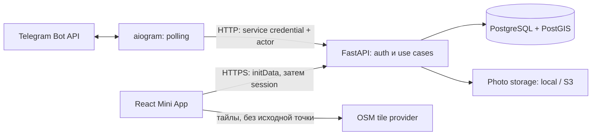
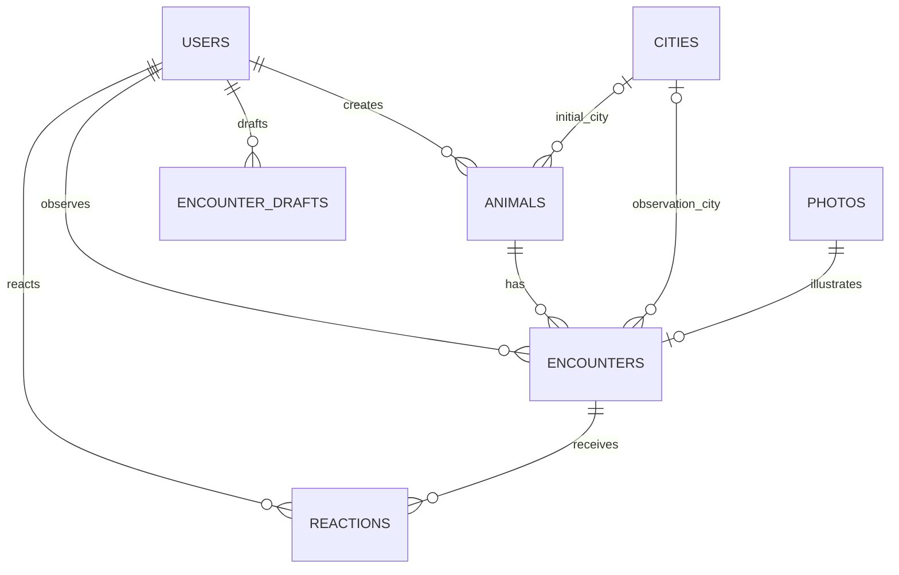

# PawSpot: архитектура

Статус: код Phase 0–8 реализован; live-тест Mini App на мобильном устройстве успешно выполнен владельцем: Telegram auth, реальные данные, Feed, Map, Collection и Profile. Полная матрица клиентов Android/iOS отдельно не подтверждена. Backend содержит auth, draft workflow, фото, matching и защищённые read API для feed/animal/map/collection/reactions. Telegram Bot остаётся интерфейсом добавления, Mini App — интерфейсом просмотра и реакций. Разделы о merge, открытом sharing и deployment описывают будущие этапы; первоначальные проектные решения ниже не во всех деталях совпадают с текущим API, фактический контракт — в `docs/api.md`.

## 1. Архитектура и границы

Простой модульный монолит с одним backend, одной БД и отдельным процессом Telegram Bot. Bot — адаптер Telegram к API, а не самостоятельный доменный сервис.



В backend: HTTP routes → Pydantic → функции services → SQLAlchemy/БД или storage. Session и граница транзакции задаются use case. Не создаём generic repository, event bus или сложный DI. FastAPI Depends достаточно для principal, session и настроек.

Backend использует синхронный SQLAlchemy/psycopg в обычных `def` endpoints: для небольшого MVP это проще. Синхронное декодирование изображений не должно блокировать async event loop. Bot использует asyncio, aiogram и async HTTP-клиент. Redis, Celery, Kafka, Kubernetes не нужны. Обработка ограниченных фото синхронная; фоновые задачи, требующие гарантии выполнения, не прячем в ненадёжный BackgroundTasks.

Map/geo layer — PostGIS и небольшие функции координат внутри backend. Карта не вызывает отдельный geo-сервис. Браузер получает только public points; тайлы загружает напрямую. Reverse geocoding не используется, исходная точка третьим geo-провайдерам не отправляется. Tile provider всё равно видит IP и область просмотра — это отражается в уведомлении о приватности.

## 2. Стек

Официальные страницы проверены 3 октября 2026. Ниже — выбранные стабильные линии, а не lockfile. Patch-версии и совместимость фиксируем в Phase 1, без prerelease и без автоматического обновления major. Наличие релиза не доказывает совместимость всей комбинации.

| Компонент | Выбранная версия / диапазон | Причина и источник |
| --- | --- | --- |
| Python | 3.14.x, обнаружен 3.14.8 | Стабильная линия; [releases](https://www.python.org/downloads/) |
| FastAPI | >=0.142.2,<0.143 | HTTP/OpenAPI; ограничиваем minor до 1.0; [PyPI](https://pypi.org/project/fastapi/) |
| SQLAlchemy | >=2.1.3,<2.2 | Актуальная стабильная 2.x; 2.0 уже maintenance; [официальные releases](https://www.sqlalchemy.org/download.html) |
| Alembic | >=1.20,<1.21 | Миграции; [PyPI](https://pypi.org/project/alembic/) |
| PostgreSQL | 18.x | Поддерживаемая стабильная линия; [versioning](https://www.postgresql.org/support/versioning/) |
| PostGIS | 3.6.x, не 3.7 RC | Нужны расстояния в метрах и spatial index; [releases](https://postgis.net/news/) |
| psycopg | >=3.3.6,<3.4 | Один драйвер PostgreSQL, локально binary extra; [PyPI](https://pypi.org/project/psycopg/) |
| Pydantic | >=2.13.5,<2.14 | Входные и выходные схемы; [PyPI](https://pypi.org/project/pydantic/) |
| aiogram | >=3.31,<3.32 | Async Bot API; [PyPI](https://pypi.org/project/aiogram/) |
| Pillow | >=12.3,<12.4 | Декодирование, EXIF removal, thumbnail; [PyPI](https://pypi.org/project/pillow/) |
| pytest | >=9.1.1,<9.2 | Проверки поведения; [PyPI](https://pypi.org/project/pytest/) |
| Node.js | 24.x LTS | Стабильный runtime frontend tooling; [releases](https://nodejs.org/en/about/previous-releases) |
| React + React DOM | 19.3.x | Один согласованный minor; [versions](https://react.dev/versions) |
| TypeScript | 7.0.x, обнаружен 7.0.2 | Стабильный компилятор; [releases](https://github.com/microsoft/TypeScript/releases) |
| Vite | 8.3.x | Поддерживаемая стабильная линия; [releases](https://vite.dev/releases) |
| Leaflet | 1.9.4 | Стабильный, 2.0 пока alpha; [download](https://leafletjs.com/download.html) |

Python dependency management — uv с lockfile; frontend — npm с package-lock. Дополнительные технические зависимости: Uvicorn, pydantic-settings, python-multipart, httpx; dev: Ruff, mypy, ESLint и frontend test runner. Их совместимые стабильные версии выбираются и фиксируются при bootstrap, а не угадываются здесь. Отдельный Telegram JS wrapper не нужен: официальный WebApp API и локальная типизация используемого подмножества. Leaflet подключаем напрямую из небольшого React-компонента, без дополнительного React wrapper. Для geometry на старте достаточно SQLAlchemy SQL functions/явных запросов PostGIS; GeoAlchemy добавляется только при реальном выигрыше в реализации.

PostGIS — осознанная зависимость: избавляет от самостоятельных географических фильтров и ошибок с градусами, полюсами и долготой ±180. Это расширение той же БД. Цена — нужен совместимый образ PostgreSQL/PostGIS в Compose и настоящая PostgreSQL в интеграционных тестах. SQLite её не заменяет.

## 3. Предлагаемая структура

Это будущая структура; Phase 0 создаёт только README и docs.

```text
README.md
pyproject.toml              # uv workspace, общие настройки проверок
uv.lock
.env.example
.gitignore
backend/
  pyproject.toml
  src/pawspot/
    main.py
    config.py
    api/                    # endpoints и зависимости HTTP
    schemas/                # входные и безопасные выходные DTO
    models/                 # SQLAlchemy
    services/               # encounter, matching, merge, photos, auth
    db.py
    storage.py              # небольшой storage protocol + local adapter
    geo.py
    cli.py                  # seed, cleanup, operator merge/hide
  migrations/
  tests/
bot/
  pyproject.toml
  src/pawspot_bot/
    main.py
    handlers/
    keyboards.py
    backend_client.py
  tests/
frontend/
  package.json
  package-lock.json
  src/
    api/
    telegram/
    pages/
    components/
  tests/
infra/
  compose.yaml              # сначала только БД
docs/
  product.md
  architecture.md
  api.md
  roadmap.md
.github/workflows/          # CI с Phase 1
```

Bot не импортирует ORM или services backend и не получает пароль БД. OpenAPI — контракт для обоих клиентов. Генератор клиентов не вводим до необходимости; сначала небольшие типизированные HTTP-функции.

В Phase 5 aiogram получает Telegram Update только в личном чате. Бот передаёт `from.id` и имя через защищённые внутренние заголовки, а все изменения draft выполняет backend. В памяти процесса бот хранит лишь подсказку, ожидает ли он текст имени или заметки; после перезапуска `/start` читает backend draft и показывает актуальный шаг либо подтверждение. Кнопка сохранения содержит UUID draft и его version; повторный callback снова вызывает идемпотентный backend commit и получает прежний Encounter. Последняя успешно показанная карточка подавляется в памяти для уменьшения дублей сообщений, но при перезапуске повторная доставка карточки возможна. Дубликаты Animal/Encounter при этом не создаются.

## 4. Данные и отношения

Доменные PK — UUID v4, они же public_id в API. Нет второй последовательной системы идентификаторов: стандартный тип PostgreSQL, простая генерация, отсутствие временной компоненты. UUID не заменяет авторизацию. `telegram_id` отдельно: BIGINT UNIQUE NOT NULL.

Все даты — timestamptz в UTC. Отображение — timezone города либо настройка клиента. Seed City: Tbilisi, GE, Asia/Tbilisi, ориентировочный центр 41.7151 / 44.8271. Никакого `if city == Tbilisi` в use cases.

| Таблица | Поля и существенные ограничения |
| --- | --- |
| users | id UUID PK; telegram_id BIGINT UNIQUE; telegram_username nullable; display_name; created_at; updated_at |
| cities | id UUID PK; slug UNIQUE; name; country_code CHAR(2); latitude; longitude; timezone; selection_radius_m; валидные диапазоны координат и IANA timezone |
| animals | id UUID PK; species VARCHAR + CHECK cat/dog; name nullable до 80 символов; primary_photo_id nullable FK; city_id nullable FK; created_by_user_id FK; status active/merged/hidden; merged_into_id nullable self-FK; created_at; updated_at |
| encounters | id UUID PK; animal_id FK; user_id FK; photo_id nullable UNIQUE FK; city_id NOT NULL FK; private_location nullable geography(Point,4326); public_location nullable geography(Point,4326); public_cell_key nullable; geo_policy_version nullable; comment до 500; observed_at; created_at; updated_at; deleted_at nullable |
| photos | id UUID PK; uploaded_by_user_id FK; storage_key UNIQUE; thumbnail_key UNIQUE; actual_mime; bytes; width; height; status ready/deleting; created_at |
| reactions | id UUID PK; user_id FK; encounter_id FK; reaction_type CHECK heart/laugh/love; created_at; UNIQUE(user_id,encounter_id,reaction_type) |
| encounter_drafts | id UUID PK; user_id FK; status active/committed/cancelled; version; photo_id nullable FK; species nullable; coordinates nullable; city_id nullable; animal_id nullable FK; new_name nullable; comment nullable; observed_at; result_encounter_id nullable UNIQUE FK; expires_at; created_at; updated_at |
| auth_sessions | id UUID PK; user_id FK; token_hash UNIQUE; expires_at; revoked_at nullable; created_at |

species — строка с ограничением, без PostgreSQL ENUM: новый вид добавляется миграцией CHECK и клиентскими подписями, архитектура сохраняется. На старте принимаем только cat/dog.



Дополнительные FK: animals.primary_photo_id → photos; drafts.photo_id → photos. Главное фото должно принадлежать видимой встрече того же Animal: проверка сервисом внутри транзакции; заменяется при удалении/скрытии соответствующей встречи. Не даём прямого CRUD поля primary_photo_id. Для Animal без видимых встреч — скрытие из discovery и пустая/недоступная карточка по ссылке, но FK и история не теряются.

При создании `private_location`, `public_location`, cell key и policy version либо согласованно NULL, либо заполнены. После retention private_location может стать NULL: CHECK требует согласованности public_location/cell key/version и запрещает private без public. Point создаётся из longitude, latitude, SRID 4326; вход требует обе координаты, конечные числа и диапазоны. Публичное представление формирует сервер, клиент его не задаёт. Текстовые CHECK, FK, uniqueness работают в БД, не только в Pydantic.

Индексы: encounters(animal_id, observed_at DESC, id), encounters(user_id, observed_at DESC, id), encounters(created_at DESC, id) для feed; GiST(public_location) по видимым встречам; reactions(encounter_id); animals(species, status); partial UNIQUE(user_id) для active drafts. Индексы по реальным запросам проверяем EXPLAIN, не индексируем всё заранее.

Animal.city_id — исходный подтверждённый контекст. Encounter.city_id сохраняет город конкретного наблюдения, поэтому перемещение не переписывает прошлое. Профиль берёт текущую область/город из последней географической встречи и может отдельно показать исходный город.

Phase 2 уточнила Phase 0 по явному решению владельца: `Encounter.city_id` обязателен, а словарь реакций — `heart/laugh/love`. Phase 4 добавляет обязательность `Encounter.photo_id` в БД и use case. При отсутствии координат город определяется из конфигурируемого контекста пилота; при координатах вне радиуса выбранного города сохранение отклоняется до выбора поддерживаемого города. Обязательный город не добавляет отдельный шаг пользователю в обычном сценарии Тбилиси.

Счётчики пока вычисляются запросами, без денормализованных колонок. Учитываются только видимые Animal/Encounter и действующие реакции. Photo count не считает thumbnails. Collection — DISTINCT animal_id по Encounter пользователя, после merge сразу отражает canonical Animal. Все связи удаления по умолчанию RESTRICT; встречи не исчезают каскадом при merge.

## 5. Общий workflow и транзакции

Черновик хранится в backend, а не только в aiogram FSM. Backend возвращает допустимые next actions; Bot и Mini App лишь показывают их. Draft живёт 24 часа, TTL конфигурируется. Coordinates черновика приватны и не возвращаются: клиент получает location_present и приблизительную область.

PATCH черновика требует version. Stale update возвращает 409; последняя кнопка от старого шага не перезаписывает новый выбор. PUT фото заменяет привязку атомарно и проверяет владельца. Повторная загрузка того же draft не должна приводить к двум Encounter.

Commit use case: блокирует draft, проверяет автора, статус, expiry, фото и выбор animal/new; разрешает merge redirect; блокирует canonical Animal; создаёт Animal при необходимости и Encounter; привязывает photo; ставит primary_photo для нового Animal; помечает draft committed и сохраняет result_encounter_id. Всё в одной транзакции БД. Повторный commit возвращает тот же результат, включая повтор после timeout. Два одновременных commit сериализуются блокировкой; UNIQUE(result_encounter_id) и UNIQUE(photo_id) — дополнительные ограничения.

Если отправка карточки в Telegram упала после commit, Encounter уже существует. Bot повторяет чтение результата и отправку сообщения, а не создание. Не обещаем exactly-once доставку Telegram-сообщения. Для долговременной дедупликации после очистки draft сохраняем компактную запись committed draft без координат/текстового payload; она остаётся ключом идемпотентности.

Storage не участвует в SQL-транзакции. Сначала записываем проверенные производные файлы, затем metadata/привязку. Сбой БД может оставить orphan; CLI cleanup удаляет только непривязанные объекты старше grace period, с повторной проверкой ссылок. До реального пилота cleanup запускается планировщиком ОС, без нового брокера.

## 6. Telegram authentication

Mini App отправляет **raw initData** в auth endpoint. Backend проверяет подпись HMAC-SHA256, свежесть auth_date и user.id; initDataUnsafe не является доказательством личности. Проверка строится по [официальной спецификации Telegram](https://core.telegram.org/bots/webapps#validating-data-received-via-the-mini-app).

Проектная процедура: ограничить длину строки; строго разобрать query string; отвергнуть повторные ключи; извлечь hash; остальные декодированные пары отсортировать по ключу и соединить LF. Не пересериализовывать JSON user до проверки. Для HMAC использовать key=`WebAppData`, message=bot token, затем полученный ключ и data-check-string; сравнение constant-time. Это HMAC-проверка собственного бота; не смешивать её с отдельной Ed25519 third-party схемой и её правилами исключения signature.

Наша политика: initData не старше 5 минут, допуск часов вперёд 30 секунд. После проверки — upsert User по telegram_id, allowlist, случайный opaque bearer token; хранится только его SHA-256, срок сессии 12 часов. Клиент держит token в памяти; при истечении старого initData предлагает заново открыть Mini App. initData и session не логируются. Короткий TTL initData ограничивает, но не исключает replay в этом окне; HTTPS и защита токена обязательны. Logout отзывает сессию. JWT/refresh token инфраструктура пока не нужна.

Bot получает Update через Telegram long polling, доверяет `from.id`, не username и не присланному тексту/контакту. Backend принимает asserted actor только с отдельным service credential на внутреннем маршруте. Публичная user-session не даёт права подменить telegram_id. Credential отделён от Telegram bot token; только секреты окружения, TLS при передаче между хостами. Bot не получает произвольную user session, а вызывает тот же use case с проверенным principal.

Polling — один процесс, для локального режима и небольшого пилота достаточно. Если позже нужен webhook, обязательны HTTPS и проверка Telegram secret-token header. Development bypass не включается в production; тестовая авторизация — через fixtures, а не публичный endpoint.

## 7. Координаты и модель угроз

Угроза: читатель API повторяет запросы, собирает встречи одного Animal, меняет radius/bbox и пытается получить точную позицию через точки, расстояния, порядок выдачи или membership. Независимый случайный jitter можно усреднить; секретное одинаковое смещение можно восстановить по известным точкам. Поэтому не выбираем эти схемы.

Решение: **фиксированная глобальная сетка**, все точки одной ячейки дают один публичный центр. Никакого нового jitter при чтении, смене пользователя или очередной встрече. Начальный конфигурационный параметр `PUBLIC_LOCATION_RADIUS_M=200` обозначает приблизительный максимальный масштаб ошибки точки, не гарантированный минимальный отступ от животного.

Простой вариант реализации v1: сетка по широте/долготе с шагом `sqrt(2) * R / 112000` градусов, якорь (-180,-90), clipping на границах и нормализация долготы. Консервативный коэффициент даёт ячейку около 283 м по широте при R=200; центр до приблизительно 200 м от исходной точки. На широте Тбилиси ширина меньше, на высоких широтах ещё меньше: это явно не одинаковая площадь приватности по всему миру. Перед запуском тестируем расстояния PostGIS на границах, ±180, у полюсов и в нескольких городах; точную гарантию в метрах нельзя заявить без этих проверок. Для расширения на высокие широты может понадобиться новая geo-policy с равноразмерными ячейками, без смены доменных сущностей.

Храним public center, cell key и версию политики при создании Encounter. Настройки не меняют старые записи молча. Повторная публикация того же места через разные сетки сужает область пересечением, поэтому смена радиуса — отдельная миграция с анализом утечки; нельзя просто менять шаг для новых встреч в уже опубликованном городе. Версия задаётся для rollout данных, а не выбирается клиентом.

Map, feed, profile, sharing, matching и media metadata используют только public representation. Публичный bbox и radius фильтруют только public_location. DTO создаются явно; ORM-модель не сериализуется целиком. Точные координаты не выдаются даже автору в MVP, не попадают в ошибки валидации, request-body logs, tracing, аналитические события или OpenAPI examples с реальными данными.

**Planned / not implemented:** retention точных координат сохранённых Encounter (первоначальный ориентир — 30 дней) относится к Phase 9. Сейчас автоматической очистки private_location сохранённых Encounter нет; параметра retention для них также нет. Существующий CHECK уже допускает public без private после будущей очистки; private без public запрещено. Точная точка draft удаляется при commit/cancel/expiry; бизнес-таблица и backup имеют разные сроки физического удаления. Копии DB+photos содержат персональные данные и точные координаты; оператор ограничивает доступ и вручную удаляет устаревшие копии. Автоматический backup retention не реализован; процедура — `docs/backup-restore.md`. Утечку самой БД эта схема не предотвращает: ограничиваем роли, доступ, шифрование диска/backup. Не вводим endpoint выгрузки private locations.

Сетка раскрывает область и может случайно совпасть центром с исходной точкой; она не даёт математической анонимности. Фото/заметки/повторяющиеся маршруты тоже раскрывают контекст. Уменьшаем риск EXIF removal, закрытым пилотом, лимитами и операторским скрытием. Не обещаем «невозможно найти животное».

## 8. Nearby matching

Matching использует species + расстояние + свежесть, но **по public points**. Это сознательное уточнение требований: private-based radius membership даже без числового расстояния превращает endpoint в инструмент точной локализации.

1. Берём координаты собственного draft и квантуем той же политикой.
2. Фильтруем активных Animal нужного species и видимые географические Encounter за последние 90 дней.
3. `ST_DWithin(public_location, query_public_point, radius_m)`; default radius 1000 м. Radius/lookback задаёт сервер, произвольные значения клиент не перебирает.
4. Группируем по Animal. Для каждого берём лучшую пару расстояние/давность конкретной встречи: например `distance/radius + age/lookback`, минимум по подходящим встречам. Не соединяем минимальное расстояние и дату из разных Encounter в несуществующее наблюдение.
5. Стабильный порядок: score, затем UUID; максимум пять кандидатов. Exact score и distance не отдаём, только «возможное совпадение поблизости».

Расстояние approximate; погрешность двух концов может составлять около 2R. У границы радиуса будут пропуски/лишние кандидаты, поэтому UI никогда не объявляет уникальность. Параметры корректируем по пилоту. Без location — matching skipped, не запрос вокруг центра города. City не является жёстким фильтром: животное около административной границы не должно исчезать.

PostGIS geography измеряет расстояние в метрах, а ST_DWithin использует spatial index: [официальная документация](https://postgis.net/docs/ST_DWithin.html). Ограничиваем frequency запросов на пользователя и IP; отсутствие приватных сигналов важнее одного лишь rate limit.

Будущий AI — дополнительный score в этом же use case после получения кандидатов. Сейчас нет embeddings, vector DB, очереди анализа или формальной plugin system. Позже алгоритм можно расширить, не меняя Animal/Encounter и ответственность пользователя за выбор.

## 9. Фотографии

Mini App загружает multipart; Bot скачивает Telegram file серверной библиотекой и передаёт байты backend. Backend не принимает URL от клиента. Telegram file URL содержит token и не должен попасть в БД или ответ; Bot API file_id не является собственным вечным хранилищем. Ограничения скачивания учитываются по [Bot API getFile](https://core.telegram.org/bots/api#getfile).

Default приложения: максимум 10 MiB и 25 мегапикселей, JPEG/PNG/WebP, только статические изображения. HEIC/HEIF и GIF пока отклоняются с понятным предложением отправить обычное фото через Telegram. Проверяем потоковый размер даже без Content-Length, сигнатуру/фактический decoder format, размеры и полное декодирование; MIME из заголовка недостаточен. SVG не принимаем. Decompression bombs и анимация отклоняются до дорогой обработки.

После EXIF orientation — перекодирование в JPEG, удаление EXIF/GPS и прочих метаданных; прозрачность сводится на нейтральный фон. Производное основное изображение до 1600 px по длинной стороне, thumbnail до 400 px. Исходник не сохраняем. Небольшая потеря качества оправдана приватностью и размером. Имена — UUID, не filename пользователя.

Storage protocol: put/read/delete для object key. Local adapter хранит файлы вне публичной static-директории; авторизованный media endpoint проверяет видимость связанной встречи. Production S3 adapter добавляется при выборе deployment, сервисы не меняются. Bucket private; выдача через backend либо короткий signed URL после проверки доступа. S3 credentials не в frontend. Thumbnail подчиняется тем же правам, что основное фото.

## 10. Merge и стабильные ссылки

Операторская команда `merge source target`, сначала dry-run с числом переносимых встреч; UI и автоматическое решение не нужны. Одна транзакция, блокировка Animal в порядке UUID. Self-merge и несовпадающий species запрещены, hidden обрабатывается явно. Разрешаем canonical target, предотвращаем цикл. Commit Encounter использует те же блокировки и заново проверяет status, поэтому параллельная запись не остаётся на уже merged source.

Переносим все source Encounter, включая soft-deleted, в target; их UUID, авторы, даты, фото и реакции сохраняются. Имя и primary photo target сохраняются, при отсутствии фото выбирается видимое из объединённых встреч. Source остаётся tombstone со status=merged и merged_into_id. Прямые aliases прежних merge перенаправляем к canonical target; сервис всё равно защищён от циклов. Счётчики и коллекции вычисляются заново. Аудит операции: source/target, оператор, время, число встреч и прежние animal_id; отдельная небольшая merge_audit таблица появляется вместе с реализацией команды. Автоматического unmerge нет.

Ссылки `/animal/{uuid}` и `/encounter/{uuid}` стабильны. У старого Animal API возвращает canonical_public_id и текущую карточку; web route переводит на canonical route, не ломая ссылку. Encounter UUID не меняется при merge. Удалённые/скрытые ресурсы недоступны вне разрешённого контекста.

Telegram Main Mini App: `https://t.me/<bot_username>?startapp=a_<uuid_without_hyphens>` или `e_...`. Payload короткий, без секретов; frontend после auth валидирует формат start_param и запрашивает ресурс через API. Это routing hint, не разрешение доступа. Механизм описан в [Telegram direct links](https://core.telegram.org/bots/webapps#direct-link-mini-apps).

Для первого закрытого пилота web share route — маленькая страница «Открыть в Telegram» без публичного фото/имени и без индексации. Если владелец выберет анонимное чтение, появится отдельный ограниченный публичный DTO/preview; полный web client по-прежнему не нужен.

## 11. Security и эксплуатация

- Same-origin HTTPS frontend/API в deployment; локальный CORS allowlist конкретных origins, никакого `*` с credentials.
- Входные ограничения и авторизация на каждом draft/photo/mutation; отдельные DTO public/self/internal.
- Plain text в React, экранирование в Telegram HTML; не использовать пользовательский HTML/Markdown как markup.
- Начальные лимиты: auth 10/min/IP, фото 10/min/user, matching 30/min/user, commit 10/min/user, body 10 MiB. Числа — настраиваемая политика пилота, не долгосрочный SLA.
- Один backend worker в пилоте позволяет простой bounded in-memory limiter плюс reverse-proxy IP limits. Счётчики сбрасываются при рестарте; перед несколькими workers нужен общий limiter. Не добавляем Redis до такого требования.
- `.env.example` содержит только placeholders; `.env`, media, backups и credentials в gitignore. В CI используются временные тестовые секреты.
- Операторские merge/hide выполняются CLI, не публичными admin endpoints. До пилота — контакт оператора и процедура удаления своих материалов/аккаунта.
- Health/readiness, request IDs, структурированные логи без секретов, SQL bind parameters и точных координат; timeout/retry по типу операции. Никаких бесконечных retry.
- PostgreSQL backup плюс backup photo storage; проверка восстановления. Шифрованные backups с ограниченным сроком хранения.

OSM standard tiles допустимы для небольшого интерактивного пилота при соблюдении [tile policy](https://operations.osmfoundation.org/policies/tiles/): видимая attribution, нормальное кеширование, Referer, отсутствие bulk download/offline prefetch. Это best-effort без SLA. Tile URL конфигурируемый; до роста нагрузки выбираем подходящего поставщика, не поднимаем свой tile server заранее.

## 12. Краткие архитектурные решения

| Problem | Decision | Reason | Trade-offs |
| --- | --- | --- | --- |
| Два интерфейса, одни правила | Backend draft + commit use case | Нет расхождения Bot/Mini App | Таблица drafts, optimistic version |
| Географические запросы | PostgreSQL + PostGIS | Метры и проверенные функции | Более специальный образ БД |
| Утечка через повторные точки/matching | Сетка и matching только public | Нет дополнительных private-сигналов | Менее точные кандидаты; не абсолютная анонимность |
| Последовательные публичные IDs | UUID v4 как PK/public_id | Простой стандарт без утечки порядка | Более крупные индексы |
| Дубли животных | Перенос Encounter + tombstone | Сохраняются ссылки и данные | Нужны блокировки и аудит |
| Local сейчас, S3 потом | Минимальный storage protocol | Меняется adapter, не use case | Orphans требуют cleanup |
| Малый пилот | Polling, один backend worker | Простой запуск | Ограничение перед масштабированием |

## 13. Критические проверки реализации

Интеграционные тесты на настоящей PostgreSQL/PostGIS: FK и reactions uniqueness; atomic commit/rollback; повтор и параллельный commit; merge вместе с созданием встречи; сохранность старых ссылок; ownership photo/draft. Geo: nulls, NaN/Infinity, перепутанные lat/lon, радиус и границы сетки, дата ±180, отсутствие ложной точности, стабильность public points, filtering/ranking без private dependencies. Auth: корректный HMAC, изменённые поля, stale/future auth_date, duplicate keys, Unicode/JSON, signature field, отсутствие user, неправильный bot token и service credential. Media: несовпадающий MIME, oversize stream, decompression bomb, EXIF removal и удалённая видимость. DTO/privacy проверяются на всех путях, включая ошибки, redirect и media metadata.
